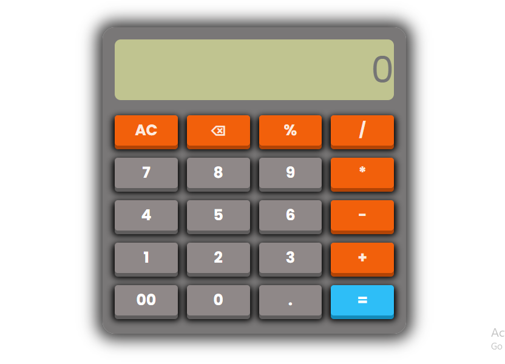

# 🧮 Calculator App

A fully functional Calculator App built using **HTML, CSS, and JavaScript**. The application supports basic arithmetic operations, percentage calculations, keyboard shortcuts, operator validation, and a responsive user interface.

🔗 **Live Demo:** https://chaudharysachinraj.github.io/Calculator-App/

📂 **GitHub Repository:** https://github.com/chaudharysachinraj/calculator-app

---

## 📌 Overview

This project was developed to practice and improve core JavaScript concepts such as DOM manipulation, event handling, functions, conditional logic, regular expressions, and error handling.

The calculator provides a clean and responsive user experience while handling common edge cases like consecutive operators and invalid expressions.

---

## ✨ Features

### ➕ Basic Arithmetic Operations

* Addition (+)
* Subtraction (-)
* Multiplication (*)
* Division (/)

### 📊 Percentage Calculations

### ⌨️ Keyboard Support

| Key         | Action                |
| ----------- | --------------------- |
| 0-9         | Number Input          |
| + - * / % . | Operators             |
| Enter       | Calculate             |
| Backspace   | Delete Last Character |
| Escape      | Clear Display         |

### 🛠 Additional Features

* Decimal number support
* Backspace button (⌫)
* All Clear button (AC)
* Smart operator replacement
* Error handling for invalid expressions
* Responsive design
* Real-time display updates

---

## 🖼️ Screenshot

Add your project screenshot inside a `screenshots` folder and update the image below.

```md

```

---

## 🛠️ Technologies Used

* HTML5
* CSS3
* JavaScript (ES6)

---

## 📂 Project Structure

```text
Calculator-App/
│
├── index.html
├── style.css
├── script.js
├── screenshots/
│   └── calculator.png
└── README.md
```

---

## 🚀 Getting Started

### 1. Clone the Repository

```bash
git clone https://github.com/chaudharysachinraj/calculator-app.git
```

### 2. Navigate to the Project Folder

```bash
cd calculator-app
```

### 3. Run the Project

Open `index.html` in your browser.

---

## 🎯 Learning Outcomes

Through this project, I learned:

* DOM Manipulation
* Event Listeners
* JavaScript Functions
* Conditional Logic
* String Methods

  * `slice()`
  * `includes()`
  * `replace()`
* Error Handling using `try...catch`
* Regular Expressions (Regex)
* Responsive UI Design
* Keyboard Event Handling

---

## 🔮 Future Improvements

* Calculation History
* Scientific Calculator Functions
* Dark/Light Mode Toggle
* Memory Operations (M+, M-, MR, MC)
* Advanced Expression Parser (without `eval()`)
* Theme Customization
* Enhanced Percentage Handling

---

## 👨‍💻 Author

**Sachin Chaudhary**

GitHub: https://github.com/chaudharysachinraj

---

## 📄 License

This project is licensed under the MIT License.

Feel free to use, modify, and distribute this project for learning purposes.
